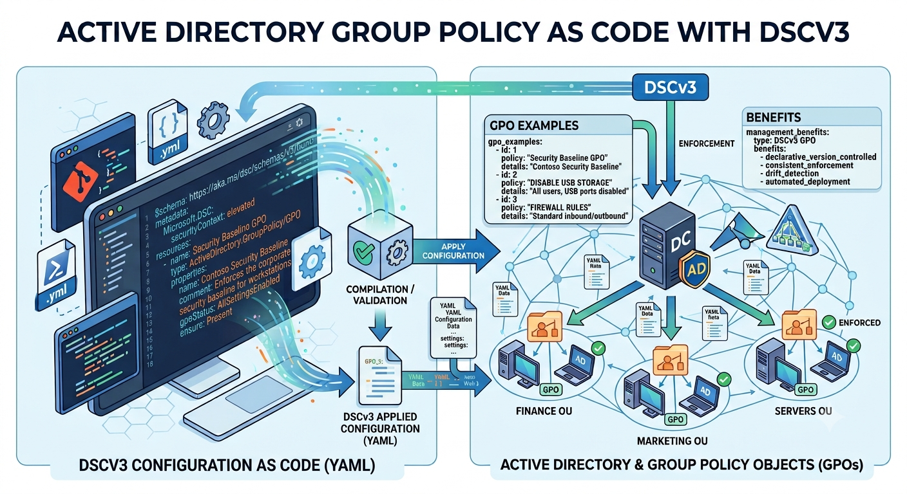
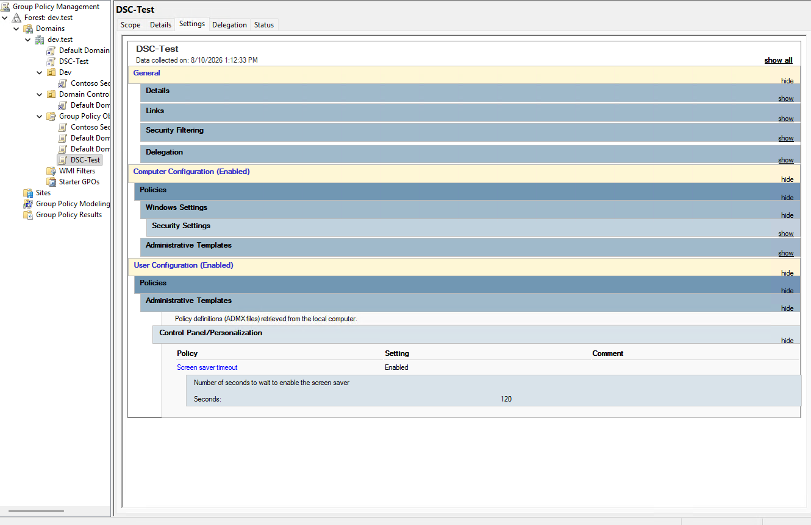
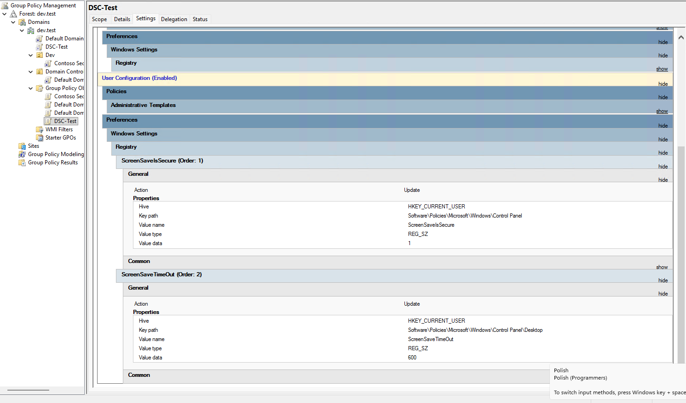

# ADSGroupPolicyDSCv3




This repository contains PowerShell DSC v3 resources for managing Active Directory Group Policy objects and settings.

## Repository Description

The resources in this project are focused on Group Policy management scenarios, including:

- GPO creation and configuration
- Group Policy links (GPLink)
- Group Policy registry settings
- Group Policy Preferences registry values

The main DSC v3 resources are located in the `resources` folder:

- `GPO`
- `GPLink`
- `GPRegistryValue`
- `GPPrefRegistryValue`

## Export existing state to a configuration document

All four resources implement the DSC v3 `export` operation, so you can inventory what already exists in the domain instead of writing the desired state by hand.

Export a single resource type:

```powershell
dsc resource export -r ActiveDirectory.GroupPolicy/GPO -o yaml > gpo-inventory.dsc.yaml
```

Export every GPO, link, and registry value into one document using [examples/export-all-resources.dsc.yaml](./examples/export-all-resources.dsc.yaml):

```powershell
dsc config export -f examples/export-all-resources.dsc.yaml -o yaml > gpo-current-state.dsc.yaml
```

Notes:

- `GPLink` export requires the `ActiveDirectory` PowerShell module (RSAT-AD-PowerShell) to enumerate every OU, domain root, and site that can hold a link.
- `GPRegistryValue` and `GPPrefRegistryValue` export walks the registry policy tree per GPO (and, for preferences, per context and hive), so it can take longer to run on GPOs with many settings.

## Example images 

  

 

## Requirements and Dependencies

These DSC v3 resources depend on Windows Group Policy management components.

To use them, the target system must have the required Windows features and RSAT tools installed for Group Policy management (for example, Group Policy Management Console and related Group Policy cmdlets).

If the required Windows Feature/RSAT components are missing, resource operations that manage Group Policy may fail.

1. Windows 11 (Client OS)On Windows 11, RSAT is managed via Features on Demand (Capabilities) using the DISM module.  
Install Group Policy Management Tools:PowerShell  
```powershell
Add-WindowsCapability -Online -Name "Rsat.GroupPolicy.Management.Tools~~~~0.0.1.0"
```
Verify Installation:PowerShell  
```powershell
Get-WindowsCapability -Online -Name "Rsat.GroupPolicy.Management.Tools*"  
```


2. Windows Server (Server OS)On Windows Server (e.g., Windows Server 2016 / 2019 / 2022 / 2025), Group Policy Management is an OS Feature managed via the Server Manager module.  
Install Group Policy Management Feature:PowerShell  
```powershell
Install-WindowsFeature -Name GPMC -IncludeManagementTools
```
Verify Installation:PowerShell  

```powershell
Get-WindowsFeature -Name GPMC
```
## Install DSCv3 resources 

In Desired State Configuration v3 (DSC v3), there is no single mandatory "root folder" like older PowerShell DSC versions had with the Local Configuration Manager (LCM).Where DSC v3 looks for resources or executables depends on how they are installed and configured:

1. The Executable Path (dsc.exe)If installed via WinGet / Microsoft Store, the dsc.exe application execution alias resides at:  
```powershell
C:\Users\<Username>\AppData\Local\Microsoft\WindowsApps\Microsoft.DesiredStateConfiguration_8wekyb3d8bbwe\dsc.exe
```

If installed manually via portable release, the root folder is whichever directory you extracted the archive to (and added to your system $env:PATH).  

2. DSC v3 Resource Discovery (Executable & Manifest Resources)DSC v3 discovers native executable resources (or adapters) by searching all directories listed in your system's PATH environment variable.  
It searches every folder in $env:PATH for resource manifest files with these suffixes:  
```powershell
*.dsc.resource.json  
*.ps1
```

To place a custom DSC v3 command-line resource so dsc resource list finds it, place the executable and its .dsc.resource.json manifest into any directory that is part of your system/user PATH.
